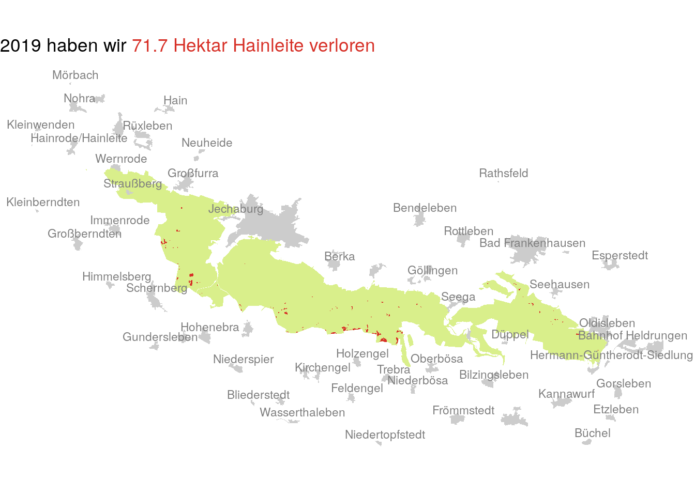
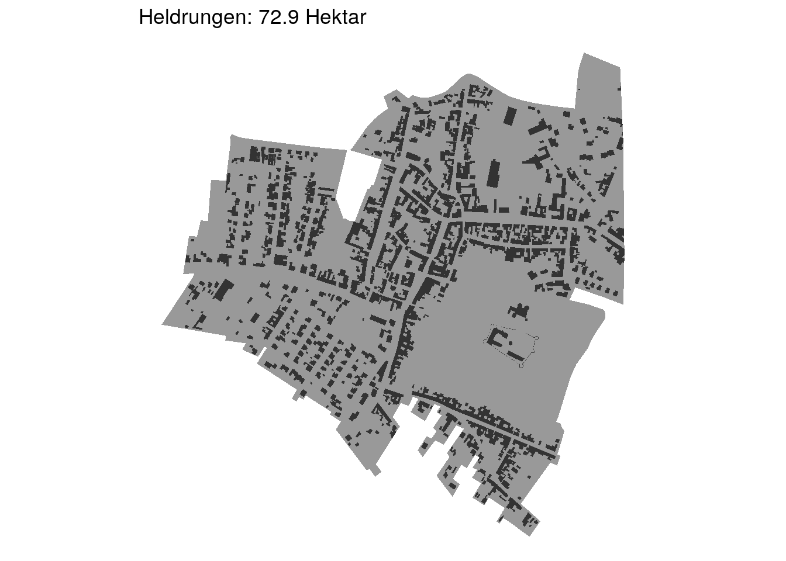

# Waldsterben Hainleite

Grab raster files from Global Forest Watch (GFW), clip them to an Openstreetmap entity (like your local forest), do some simple ggplot charts over time and space and output an html report. 

We visualize lost treecover areas like this: 

And put these areas into perspective by comparing to known settlements in the region: 

## How to use

The Rmd code assumes you have your GFW raster in the data directory. You can get them from [here](https://data.globalforestwatch.org/datasets/14228e6347c44f5691572169e9e107ad). 

We're also using shapefiles of housing and settlement areas, in our case [from Thuringia](https://www.geoportal-th.de/de-de/Downloadbereiche/Download-Offene-Geodaten-Th%C3%BCringen)